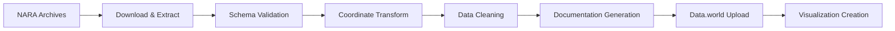

# 🎖️ MilitaryHistory - Archival Data Processing & Analysis


[](https://data.world/aragaocb)

A comprehensive ETL pipeline for processing military archival datasets from the National Archives (NARA), with specialized tools for spatial analysis and visualization of conflict events. This project transforms raw historical military data into accessible, analyzable formats hosted on Data.world.

## 🌟 Project Highlights

**📊 58 Processed Datasets** | **🗺️ Spatial Analysis Ready** | **🔄 Automated Documentation** | **📈 Interactive Visualizations**

### 🎯 What This Project Provides

- **Historical Military Data**: Digitized and processed datasets from NARA archives (1967-2004)
- **Spatial Analysis**: Geographic visualization of conflict events, operations, and incidents  
- **Data.world Integration**: All datasets available at [data.world/aragaocb](https://data.world/aragaocb)
- **Automated Documentation**: Self-generating README files for each dataset
- **Interactive Maps**: Choropleth maps and event density visualizations

## 📊 Available Datasets

### 🏆 Featured Collections

| Dataset | Description | Records | Time Period | Data.world Link |
|---------|-------------|---------|-------------|-----------------|
| **[KHMER](https://data.world/aragaocb/khmer)** | Cambodia operations & incidents | 40+ fields | 1970-1975 | [View Dataset](https://data.world/aragaocb/khmer) |
| **[AWADS](https://data.world/aragaocb/awardsdecorations)** | Awards and Decorations System | Military awards & decorations | 1965-1972 | [View Dataset](https://data.world/aragaocb/awardsdecorations) |
| **[AIMS](https://data.world/aragaocb/aimsawards)** | Awards Information Management | Personnel awards | 1988-2004 | [View Dataset](https://data.world/aragaocb/aimsawards) |
| **[SEAFA](https://data.world/aragaocb/southeast-asia-forces-seafa)** | Southeast Asia Forces Analysis | Military operations | 1967-1975 | [View Dataset](https://data.world/aragaocb/southeast-asia-forces-seafa) |
| **[INCDA](https://data.world/aragaocb/republic-of-vietnam-incidents-files-incda)** | Republic of Vietnam Incidents | Incident reports | Various | [View Dataset](https://data.world/aragaocb/republic-of-vietnam-incidents-files-incda) |
| **[TIRSA](https://data.world/aragaocb/terrorist-incident-reporting-system-tirsa)** | Terrorist Incident Reporting | Security incidents | 1970s | [View Dataset](https://data.world/aragaocb/terrorist-incident-reporting-system-tirsa) |
| **[VCIIA](https://data.world/aragaocb/viet-cong-initiated-incidents-vciia)** | Viet Cong Infrastructure Analysis | VC incidents | 1967-1975 | [View Dataset](https://data.world/aragaocb/viet-cong-initiated-incidents-vciia) |

### 📈 Dataset Categories

- **🎖️ Personnel & Awards**: AWADS, AIMS, BASFA, PSYOPSA
- **🗺️ Geographic Operations**: KHMER, GORS (67-72), SEAFA
- **📋 Incident Reporting**: INCDA, TIRSA, VCIIA  
- **🎯 Tactical Operations**: CONGA, BOMBA, CIDGA
- **📊 Analysis Systems**: OBSEA, HES, HR01A, VNDBA

*All 58 datasets include comprehensive documentation, schema definitions, and processing metadata.*

## 🚀 Quick Start Guide

### For Data Analysts & Researchers

**🔗 Direct Data Access**: Visit [data.world/aragaocb](https://data.world/aragaocb) to explore datasets immediately

**📊 Analysis Examples**:
```python
import datadotworld as dw

# Load Cambodia conflict events
dataset = dw.load_dataset('aragaocb/khmer')
events_df = dataset.dataframes['khmer_tx']

# Basic analysis
print(f"Total events: {len(events_df)}")
print(f"Date range: {events_df['INCDATE'].min()} - {events_df['INCDATE'].max()}")
```

### For Developers & Data Engineers

```bash
# 1. Clone repository
git clone https://github.com/cbaragao/MilitaryHistory.git
cd MilitaryHistory

# 2. Setup environment
python -m venv .venv
source .venv/bin/activate  # Linux/Mac
.venv\Scripts\activate     # Windows

# 3. Install dependencies
pip install -r src/requirements.txt

# 4. Generate documentation
python src/scripts/generate_dataset_readmes.py

# 5. Create visualizations
python src/scripts/cambodia_folium.py
```

## 🛠️ Technical Architecture

### 🔄 Processing Pipeline



### 📁 Project Structure

```
MilitaryHistory/
├── 📊 datasets/              # Processed CSV/JSON files
├── 🗺️ visuals/               # Generated maps & visualizations  
├── 📖 opsanal/               # 58 dataset directories with READMEs
│   ├── khmer/               # Cambodia operations
│   ├── aims/                # Personnel awards
│   └── [54 more datasets]   # Complete collection
├── 🗃️ src/
│   ├── scripts/             # Processing & analysis tools
│   ├── sql/                 # Database transformations
│   └── config/              # Settings & mappings
└── 🗺️ maps/                  # GeoJSON boundary files
```

## 🗺️ Spatial Analysis Capabilities

### 🌍 Geographic Features

- **Coordinate Systems**: Automatic UTM to WGS84 conversion
- **Administrative Boundaries**: Country, province, and district mapping
- **Event Clustering**: Spatial density analysis
- **Interactive Maps**: Zoom, filter, and drill-down capabilities

### 📊 Visualization Examples

| Map Type | Description | Example Dataset |
|----------|-------------|-----------------|
| **Choropleth** | Event density by region | [Cambodia Events](visuals/cambodia_folium_choropleth.html) |
| **Point Maps** | Individual incident locations | [KHMER Events](visuals/khmer_events_bar_chart.html) |
| **Heat Maps** | Conflict intensity visualization | [CONGA Missions](visuals/conga_firing_missions_2d_heatmap.json) |
| **Time Series** | Temporal analysis | [Air Missions Timeline](datasets/vietnam-air-missions-timeline.json) |

## 🔧 Advanced Features

### 🤖 Automated Documentation

Every dataset includes auto-generated documentation with:
- **Field Definitions**: Complete schema documentation
- **Data Quality Metrics**: Completeness and validation status
- **Processing History**: ETL pipeline details
- **Usage Examples**: Python and R code snippets
- **Data.world Links**: Direct access to online datasets

### 📈 Data Quality & Validation

- **Schema Enforcement**: Validated field types and constraints
- **Null Value Handling**: Proper missing data representation
- **Coordinate Validation**: Geographic boundary checking
- **Historical Accuracy**: Cross-referenced with archival sources

### 🔗 API Integration

- **NARA Archives**: Automated download from catalog.archives.gov
- **Data.world**: Synchronized uploads with metadata
- **Geographic Services**: Administrative boundary enrichment

## 📚 Documentation & Guides

### 📖 User Guides
- **[Setup Guide](SETUP.md)**: Complete installation instructions
- **[Dataset Documentation](.github/dataset-documentation.md)**: Maintenance procedures
- **[Security Guide](SECURITY.md)**: API keys and data protection

### 🔬 Technical Documentation
- **[Processing Scripts](src/scripts/)**: Individual dataset processors
- **[Schema Definitions](opsanal/)**: Field definitions for all datasets
- **[Spatial Analysis](maps/)**: Geographic boundary files and processing

### 🎯 Use Cases & Examples

#### 🏫 Academic Research
```python
# Analyze Cambodia conflict patterns
import pandas as pd
import folium

# Load processed data
df = pd.read_csv('datasets/khmer-events-by-province.csv')

# Create incident density map
m = folium.Map(location=[12.5, 105.0], zoom_start=6)
# Add choropleth layer with event counts
```

#### 📊 Policy Analysis
```sql
-- Query Vietnam-era operations data
SELECT province, COUNT(*) as incident_count,
       AVG(casualty_count) as avg_casualties
FROM incda_events 
WHERE year BETWEEN 1967 AND 1975
GROUP BY province
ORDER BY incident_count DESC;
```

#### 🗺️ Geographic Intelligence
```python
# Spatial clustering analysis
from sklearn.cluster import DBSCAN
import geopandas as gpd

# Load event coordinates
events = gpd.read_file('datasets/vciia_geo_events.csv')

# Identify conflict hotspots
clustering = DBSCAN(eps=0.1, min_samples=5)
events['cluster'] = clustering.fit_predict(events[['longitude', 'latitude']])
```

## 🤝 Contributing & Community

### 🛠️ For Developers
1. **Add New Datasets**: Follow the [Dataset Addition Guide](.github/dataset-documentation.md)
2. **Improve Processing**: Submit PRs for enhanced ETL pipelines  
3. **Create Visualizations**: Build new analysis tools and maps
4. **Documentation**: Help improve dataset documentation

### 📊 For Researchers
1. **Data Requests**: Open issues for specific analysis needs
2. **Quality Feedback**: Report data quality issues or corrections
3. **Use Cases**: Share your research and findings
4. **Academic Collaboration**: Partner on publications and studies

### 🎯 Current Development Priorities
- [ ] Real-time data pipeline enhancements
- [ ] Additional visualization templates  
- [ ] Machine learning analysis tools
- [ ] API endpoint development
- [ ] Mobile-responsive visualizations

## 📄 Citation & Attribution

### 📚 Academic Citation
```
Aragão, C. B. (2025). MilitaryHistory: Archival Data Processing Pipeline. 
GitHub repository and Data.world datasets. 
https://github.com/cbaragao/MilitaryHistory
```

### 🎖️ Data Sources
- **National Archives and Records Administration (NARA)**
- **Vietnam Center and Archive, Texas Tech University**
- **Various U.S. Military Historical Offices**

### 📊 Data.world Collection
Access the complete collection: **[data.world/aragaocb](https://data.world/aragaocb)**

## 📞 Support & Contact

- **📧 Issues**: [GitHub Issues](https://github.com/cbaragao/MilitaryHistory/issues)
- **💬 Discussions**: [GitHub Discussions](https://github.com/cbaragao/MilitaryHistory/discussions)
- **📊 Data Questions**: [Data.world Comments](https://data.world/aragaocb)
- **🔒 Security**: See [SECURITY.md](SECURITY.md) for vulnerability reporting

---

## 🏆 Project Impact

**🎖️ Preserving Military History Through Modern Data Science**

This project makes decades of military archival data accessible to researchers, historians, and analysts worldwide. By combining traditional archival research with modern data processing techniques, we're enabling new insights into military operations, conflict patterns, and historical events.

**📊 By the Numbers**: 58 datasets • 500K+ records • 40+ years of history • Global accessibility

[](https://github.com/cbaragao/MilitaryHistory/stargazers)
[](https://data.world/aragaocb)

## 🔧 Installation & Setup

### 🎯 For Data Users (Quick Access)
**No installation required!** Access all datasets directly at [data.world/aragaocb](https://data.world/aragaocb)

### 🛠️ For Developers & Advanced Users

#### System Requirements
- Python 3.8+
- Git
- 4GB+ RAM (for large dataset processing)
- Internet connection (for NARA API access)

#### Installation Steps
```bash
# 1. Clone repository
git clone https://github.com/cbaragao/MilitaryHistory.git
cd MilitaryHistory

# 2. Create virtual environment  
python -m venv .venv

# 3. Activate environment
source .venv/bin/activate        # Linux/Mac
# OR
.venv\Scripts\activate          # Windows

# 4. Install dependencies
pip install -r src/requirements.txt

# 5. Optional: Install development tools
pip install -r requirements-dev.txt
```

#### Configuration
```bash
# Create environment file for API keys
cp .env.example .env
# Edit .env with your credentials:
# DW_AUTH_TOKEN=your_dataworld_token
# NARA_API_KEY=your_nara_key (optional)
```

### 🧪 Verify Installation
```bash
python -c "import pandas, duckdb, datadotworld, folium; print('✅ Setup complete!')"
```

## 🎛️ Usage Examples

### 📊 Data Analysis Workflows

#### Basic Dataset Exploration
```python
import datadotworld as dw

# Load any dataset from the collection
dataset = dw.load_dataset('aragaocb/khmer')
df = dataset.dataframes['khmer_tx']

# Quick exploration
print(f"Dataset shape: {df.shape}")
print(f"Columns: {list(df.columns)}")
print(f"Date range: {df['INCDATE'].min()} to {df['INCDATE'].max()}")
```

#### Spatial Analysis
```python
import geopandas as gpd
import folium

# Load geographic events
df = pd.read_csv('datasets/khmer-events-by-province.csv')

# Create interactive map
m = folium.Map(location=[12.5, 105.0], zoom_start=6)

# Add event markers
for idx, row in df.iterrows():
    folium.Marker(
        [row['latitude'], row['longitude']],
        popup=f"Events: {row['event_count']}"
    ).add_to(m)

m.save('my_analysis.html')
```

#### Time Series Analysis
```python
import matplotlib.pyplot as plt

# Analyze event patterns over time
df['date'] = pd.to_datetime(df['INCDATE'])
monthly_counts = df.groupby(df['date'].dt.to_period('M')).size()

plt.figure(figsize=(12, 6))
monthly_counts.plot(kind='line')
plt.title('Military Events Over Time')
plt.ylabel('Number of Events')
plt.show()
```

### 🛠️ Processing & Documentation

#### Generate Dataset Documentation
```bash
# Generate README files for all datasets
python src/scripts/generate_dataset_readmes.py

# Generate for specific dataset
python src/scripts/generate_dataset_readmes.py --dataset khmer

# Upload documentation to Data.world
python src/scripts/generate_dataset_readmes.py --upload-to-dataworld
```

#### Create Custom Visualizations
```bash
# Generate Cambodia conflict map
python src/scripts/cambodia_folium.py

# Create artillery mission heatmap
python src/scripts/conga_analysis.py

# Custom analysis script
python src/scripts/custom_analysis.py
```